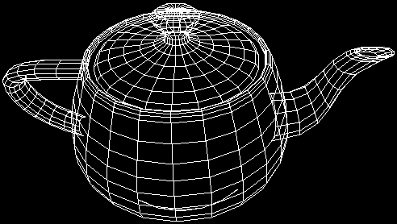
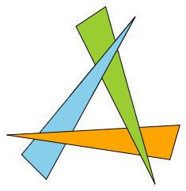

# [SVG 3D](https://tomashubelbauer.github.io/svg-3d)

SVG 3D allows you to render out a 3D animation into an SVG file using the SMIL
`animate` element to animate an SVG `polyline` element's `points` attribute
value in order to produce motion of the vertices, edges and ultimately, faces.
Only wireframe rendering is supported at the moment, however material rendering
is going to be explored in the future as well.

SVG 3D is meant for embedding 3D wireframe animations into MarkDown and HTML
documents for the purposes of education, documentation, exploration and so on.
The animated SVGs will be played back by VS Code MarkDown preview as well as
GitHub MarkDown and SVG preview among other things.

## Why not: `canvas`, `video`, WebGL, GIF, APNG, WebP, CSS animation, …

- `canvas`, `video` & WebGL will not play back in MarkDown preview renderers
- GIF is a raster format with poor quality and no support for scaling
- APNG and WebP are solid contenders but still raster and not scalable like SVG
- CSS animations standalone cannot be used in MarkDown preview renderers
- CSS animations instead of SMIL in SVG cannot animate the `points` attribute

## Features

- Works in MarkDown when embedded as an image (VS Code preview, GitHub preview)
- Vector format is scalable without quality loss with inspectable source code
- File sizes are small and plain text format is GZIP friendly in HTTP transfer
- Can potentially be made interactive when hosted in HTML using an SVG element

## Development

Open `index.html` and hack!

Configure your browser to support `fetch` over `file:` protocol or run using a
static web server at your preference.

### To-Do

#### Ponder on the options for interactivity

There are two ways to make the SVGs interactive:

1. SVG SMIL animation triggers which might still work when embedded in an `img`
2. JavaScript DOM control which will only work when embedded in an `svg` in HTML

It is best when the amount of vertices is static (so all elements are used 100 %
of the time and we do not need to store extra elements outside  of the viewport
to bring in later when more mesh is needed) however it is not strictly required
as JavaScript DOM manipulation can bring elements in and out (but will cause a
relayout).

For the HTML-bound JS-powered scenario, extend the UI to include PTZ and orbit
control.

A physics engine could also be hooked in. For JS it would just affect the mesh
directly, for SMIL we could bake the animation in.

- https://brm.io/matter-js
- http://wellcaffeinated.net/PhysicsJS
- http://piqnt.com/planck.js
- https://github.com/lo-th/Oimo.js
- https://github.com/kripken/box2d.js

See how these are in terms of integration with 3rd paties. I don't want their
rendering and I want to be able to simply send in the meshes in a basic format
instead of adopting something which is too complex for my needs.

It would also be useful to filter out those which support dead body indication
so I could use that as a marker for the end of an animation when doing animation
in the SVG or using CSS in SVG.

#### Measure performance using Playwirght to record SVG DOM state at each point

We can check the SVG DOM in each tick and collect performance metrics.
Playwright also has a profiling API could also be used (includes screenshots).
This performance testing could be run against Chrome/Edge and Firefox and Safari
to see how it compares across the browsers and across changes I make.

#### Attach rotation and translation to a transform array on the mesh

Right now they sit in `render`. Once the `rotate` function is in `esm-matrix`,
add one for translation and then a combining one for rotation around origin and
use those in index to position the model before rendering it. Rendering will
then only accept camera position and orientation and the mesh with its transform
array.

#### Pull out the `rotate` transformation and implement other transformations

Add translate, scale, skew. Move these either to the `esm-matrix` library or a
whole new library.

#### Prototype depth-sensitive strokes in another project

Find a way to render edges as polylines or multiple line elements whose strokes
gradually vary in relation to their depth respective to the camera.

If there is no way to do this using a polyline and multiple lines have to be
used, it is not a good fit for this project, as in this project, a static number
of DOM elements in the SVG is one of the goals, but it will still be cool to
have this as an experiment somewhere.

#### Implement object tesselation functions and consider pulling them out

Example tesselators: box, prism, sphere (of tris, quads, spool-like stripes, …).
Also the Utah teapot and maybe Suzanne depending on complexity.

#### Add an example OBJ which uses the line shape and update box and prism to it

Wavefront OBJ supports a `l` element so it can be used.

#### Consider implementing the hierarchy transformation model: world-scene-mesh

This is the standard in 3D and video game industries so it might make sense to
adopt it if I want to make this robust eventually.

#### Experiment with shape culling solutions using stroke and fill gradient/mask

SVG has a few interesting bits related to stroke and fill styling. Perhaps these
could be used to implement wireframe or even textured edge and face culling.

https://en.wikipedia.org/wiki/Back-face_culling

In the image here, culled shapes are hidden, but they could also be made semi-
transparent etc.

For this to work, the shapes need to be rendered back to front to begin with,
which should be just a matter of sorting them that way when inserting to the
fragment and rearranging them when reconciling. Not sure how to do this in the
SVG or CSS in SVG animation if I get around to that.

Something like this could be then made to work:

The triangles, at the place where they overlap, would use a fill mask to implant
the texture from the shared area of the shape that overlaps them at that area.

Another thing this could help enable would be to hide shapes which are fully or
partially behind the camera. Right now they appear and are distorted. When only
partially outside (or behind) of the viewport, the Bresenham algorithm could be
used on the edges of the face (in case of a shape with an area) in order to sort
of "ray-trace" the length of the edge until it meets the edge and then use the
above techniques to cull the rest of the edges and mask away the hidden portion
of the shape's fill.

Useful links for this:

- https://stackoverflow.com/q/42874203/2715716
- https://css-tricks.com/svg-line-animation-works

#### Support ellipses if their perspective representation can be approximated

I will have to research this, but I believe an ellipse in 3D might still be
representable using an ellipse in 2D even accounting for its orientation and
perspective distortion. And if not an ellipse, perhaps a combination of ars,
say two Beziers making up a single ellipse?

The question is whether it is worth the effort, if the reduced DOM node count
will matter when faced with the rasterization complexity of ellipses as opposed
to polylines (is it more expensive?).

#### Introduce mutating methods for matrix and point manipulationin `esm-matrix`

Mutating the matrices in place is faster than generating new instances and
replacing the references, so all matrix operations will need to be updated to
reflect this.

#### Implement cutting out the lines parts which cross the camera plane

This will need to be precomputed based on the entire animation so we know to
split them up from the get-go, but they could be cut and the part which is behing
the camera plane hidden.

#### Implement hiding lines by curling them up to a point outside of the canvas

This will enable culling for hiding shapes behind camera plane etc.

### Play around with chromatic aberration filter and use it for the "Me" demo

https://inkscape.org/~fabien.fellay/%E2%98%85chromatic-aberration-filters

This would work by triplicating all the shapes and marking each copy to be drawn
with a different color. Not sure if the animation could be reused for each of the
three instances or if it will have to be duplicated as well.
